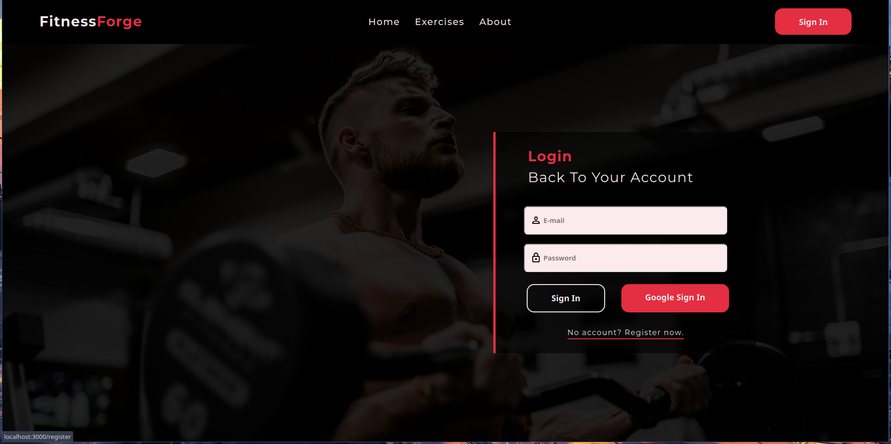

# FitnessForge
A customizable fitness app that intelligently designs workout plans based on user goals, available time, and fitness levels.

## Table of Contents
- [About the Project](#about-the-project)
- [Some Images](#some-images)
- [Tech Stack](#tech-stack)
- [Features](#features)
- [Getting Started](#getting-started)
    - [Prerequisites](#prerequisites)
    - [Installation](#installation)
    - [Usage](#usage)
- [Contributing](#contributing)
- [Acknowledgments](#acknowledgments)
- [License](#license)
- [API Documentation](https://github.com/Karan2004xd/fitness-forge/blob/main/API-DOCS.md)
- [Backend Code Docs (generated by javadoc)](https://karan2004xd.github.io/fitness-forge/)

## About the project

Fitness Forge is a sophisticated fitness app that tailors workouts to individual needs. By combining user-defined templates, goals, and time constraints with an extensive exercise database of 874 exercises, Fitness Forge uses an algorithm that takes into account average reps, sets, and rest times to generate optimized workout plans. Whether you're looking to focus on strength, cardio, or overall fitness, Fitness Forge creates a personalized fitness journey for each user.

## Some Images

#### Landing Page


#### Regisration Page


**More images can be found [here](https://github.com/Karan2004xd/fitness-forge/tree/main/webpage-images)**

## Tech Stack

- **Frontend**: React, Redux
- **Backend**: Spring Boot, JPA
- **Database**: PostgreSQL
- **API**: RESTful APIs with JWT authentication

## Features

- **Custom Workout Templates:** Users can create unique workout plans with custom categories, duration, and cardio days.
- **Time-Based Workouts:** Each workout is optimized for the user’s available time.
- **Personalized Exercise Selection:** The algorithm considers goals and preferences to select the best exercises.
- **Extensive Database:** Access to a library of 874 exercises with different focus areas.

## Getting Started

### Prerequisites

- Node.js
- Java (for backend)
- PostgreSQL

### Installation

1. Clone the repo:
    ```bash
    git clone https://github.com/Karan2004xd/fitness-forge
    ```
2. Install Dependencies for the frontend
    ```bash
    cd fitness-forge/frontend
    npm install
        or
    yarn install

### Setup

1. Setup for backend:

    Create the following environment variables,
    ```bash
    # Environment variables for Database 
    export DB_USERNAME="<your database username>"
    export DB_PASSWORD="<your database password>"

    # Environment variables for application
    export SECRET_KEY="<your-secret-key>" # make sure it is a strong secret key, since this secret key will be used in JWT token authentication.

    # Environment variables for backend docs generation script
    export FITNESS_FORGE_ROOT_DIR="<path-to-project-root-dir>"
    export CREATE_DOCS_SCRIPT_PATH="<path-to-project-root-dir>/docs/scripts/create_backend_docs.sh"
    ```

    **Note**: This is syntax of defining environemnt variables in zshrc, make sure to refer to your own syntax, but the names should remain the same.
    
    Inorder to create the database schema in your database,

    1. Create a database named **fitnessforge**.
    2. Inside `/fitness-forge/backend/src/main/resources/application.yml` set,
        ```bash
        ddl-auto: create # it will generate the full schema of the application when you run the application,
                         # but make sure to set it to update after generating the database
        ```

2. Setup the frontend

    1. Create **.env** file at `/fitness-forge/frontend` and add the following variables inside it.
    ```bash
    # Firebase API key for sign in with google features
    REACT_APP_FIREBASE_API_KEY="<your-firebase-api-key>";
    REACT_APP_DEFAULT_PAGE_SIZE=20
    ```

    2. Replace the configuration in variable **firebaseConfig** at `/fitness-forge/frontend/src/utils/firebase/firebase.utils.ts`, with your own firebase configuration.

### Usage

For backend,
```bash
# For running the application
mvn clean spring-boot:run

# For testing the application
mvn test
```
For frontend,
```bash
# For running the application
yarn start
or
npm start   
```
And that's all, you should be ready to go, in-case if you find any issues feel free to create an issue.

## Contributing

Contributions are what make the open-source community amazing! If you’d like to contribute, please follow these steps:

1. Fork the repository.
2. Create a branch for your feature or bugfix.
3. Commit your changes and open a pull request.

## Acknowledgments

- Thanks to the [Spring Boot](https://spring.io/projects/spring-boot) and [React](https://reactjs.org/) communities for their resources and guidance.
- Thanks to this github [repo](https://github.com/yuhonas/free-exercise-db), this project was created because this repo provides a very well structured and comprehensive exercises dataset which is absolutely free to use, and also provides great instructions and images for each exercise.

## License

MIT License

Copyright (c) 2024 Karan Prajapati

Permission is hereby granted, free of charge, to any person obtaining a copy
of this software and associated documentation files (the "Software"), to deal
in the Software without restriction, including without limitation the rights
to use, copy, modify, merge, publish, distribute, sublicense, and/or sell
copies of the Software, and to permit persons to whom the Software is
furnished to do so, subject to the following conditions:

The above copyright notice and this permission notice shall be included in all
copies or substantial portions of the Software.

THE SOFTWARE IS PROVIDED "AS IS", WITHOUT WARRANTY OF ANY KIND, EXPRESS OR
IMPLIED, INCLUDING BUT NOT LIMITED TO THE WARRANTIES OF MERCHANTABILITY,
FITNESS FOR A PARTICULAR PURPOSE AND NONINFRINGEMENT. IN NO EVENT SHALL THE
AUTHORS OR COPYRIGHT HOLDERS BE LIABLE FOR ANY CLAIM, DAMAGES OR OTHER
LIABILITY, WHETHER IN AN ACTION OF CONTRACT, TORT OR OTHERWISE, ARISING FROM,
OUT OF OR IN CONNECTION WITH THE SOFTWARE OR THE USE OR OTHER DEALINGS IN THE
SOFTWARE.
